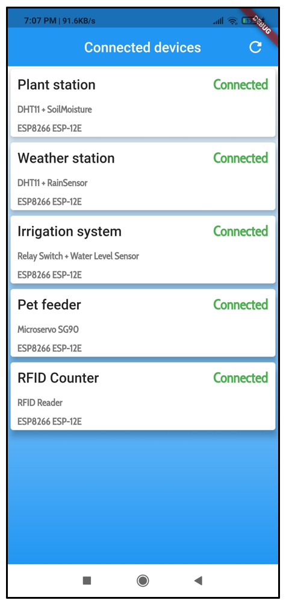
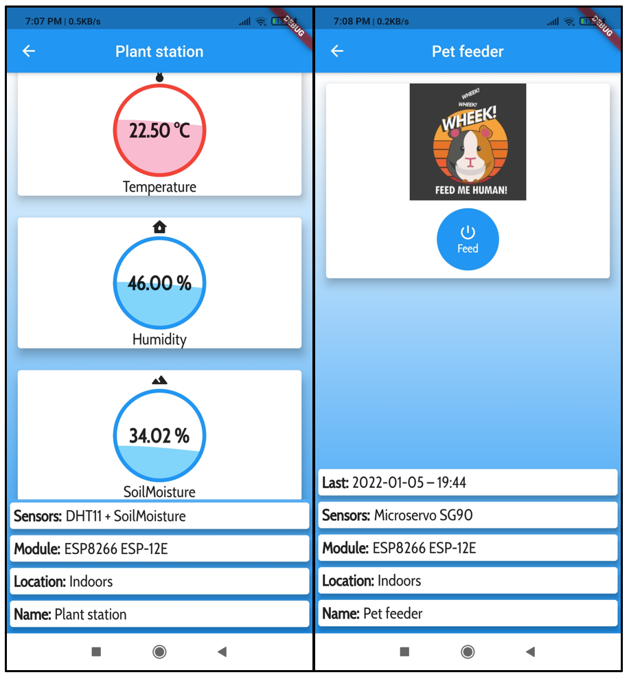

# GraduateWork
Graduate work for Faculty of Organisation and Informatics (Diplomski rad)

Final version can be downloaded from this link: https://repozitorij.foi.unizg.hr/islandora/object/foi%3A7037

This work consists out of five smaller IoT projects and a central mobile application. Primary goal was to upgrade "Internet of Things" projects to "Web of Things". That's why every IoT project is connected to Firebase via Web protocols. Firebase is used as a central database and a link between projects and mobile application.

Mobile application was created using Dart language and Flutter framework. Application is retrieving data from Firebase Realtime Database and displays it on screen, in realtime. Each project dashboard is different, but it is made out of single codebase. That's what makes this app modular. It is not important how many data does user have in a database, they will all be properly displayed. Each data type will get it's own equally wide column. For example, if there is four types of data stored in a database (numerical, non-numerical, interactive,...) there will be four columns with it's data. Also, each column will be independent and scrollable. At the bottom of the screen is basic info about that project.

NodeMCU Lolin v3 with ESP-01 Wifi Module and ESP8266 SoC was used for IoT projects. Development boards were programmed with ArduinoIDE and each script can be found in "ArduinoIDE Scripts" folder. 

List of all IoT projects

Weather station dashboard with temperature/humidity readings from DHT11 sensor (numerical) and rain readings from Rain sensor (non-numerical)

Plant station and Pet feeder dashboards

Relay switch and RFID counter dashboards

Weather station with DHT11 and Rain sensor

Plant station with DHT11, Moisture sensor and LCD display

Relay switch embedded in an extension cord with Water level sensor (so it can be used in automatic irrigation projects)

RFID Counter with RFID card and RFID tag

Pet feeder with servo motor
